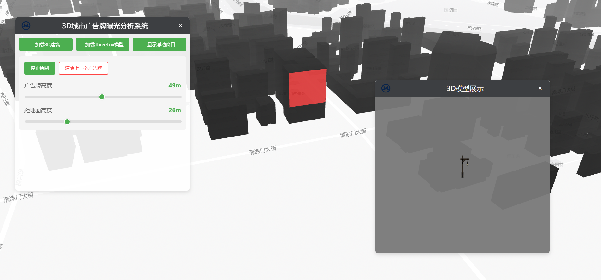

# 3D-City-Adv
3D城市广告牌曝光分析系统

## Inference
[1] Q. Yu, D. Feng, G. Li, Q. Chen, and H. Zhang, “AdvMOB: Interactive visual analytic system of billboard advertising exposure analysis based on urban digital twin technique,” Advanced Engineering Informatics, vol. 62, p. 102829, Oct. 2024, doi: 10.1016/j.aei.2024.102829.

[2] https://github.com/ni1o1/advtise-demo
