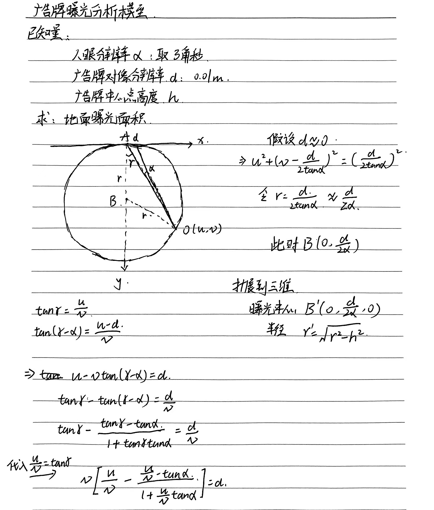

# 3D-City-Adv · 3D城市广告牌曝光分析系统


## 项目结构


## 运行项目
**前端**
```
cd front
npm install
npm run serve
```

**后端**
```
cd server
pip install -r requirements.txt
python app.py
```

## 参考了这篇论文，按照论文思路实现
[1] Q. Yu, D. Feng, G. Li, Q. Chen, and H. Zhang, “AdvMOB: Interactive visual analytic system of billboard advertising exposure analysis based on urban digital twin technique,” Advanced Engineering Informatics, vol. 62, p. 102829, Oct. 2024, doi: 10.1016/j.aei.2024.102829.

## 原理介绍
### GEA(Ground Exposure Area)：地面曝光面积
```
1. 计算广告牌中心点坐标、高度
2. 计算广告牌方向向量（顺时针90度）
3. 计算曝光区域圆心坐标、半径
```
