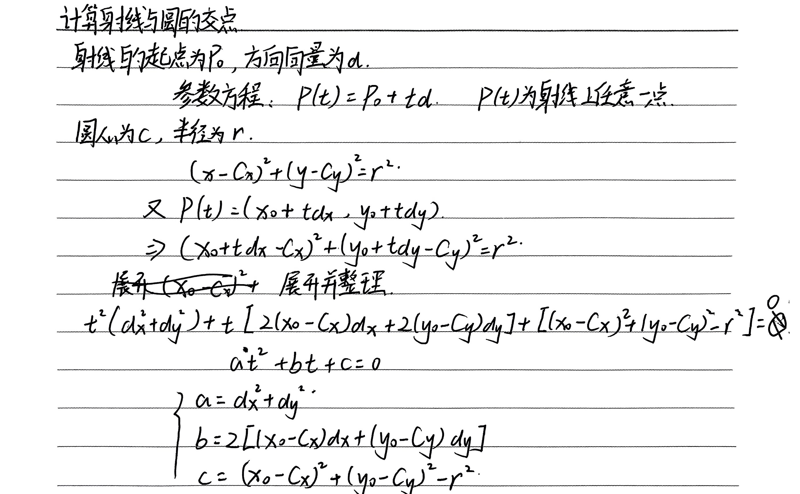
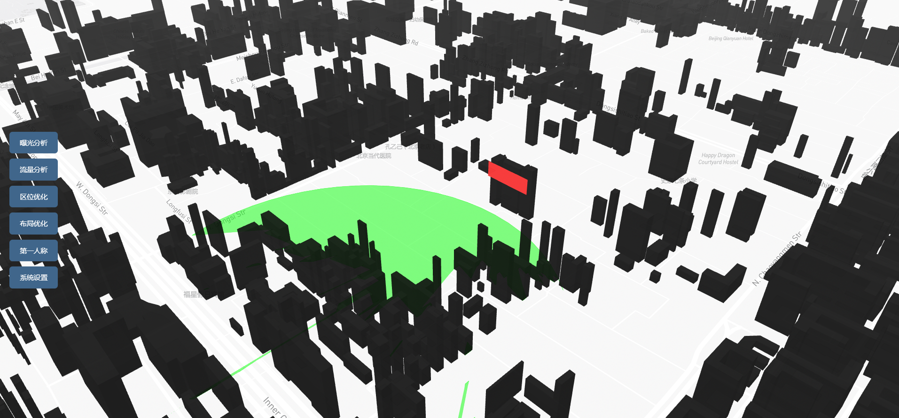
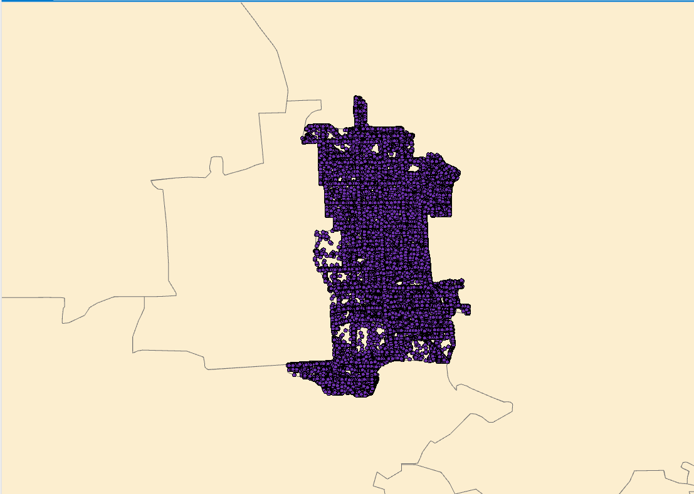
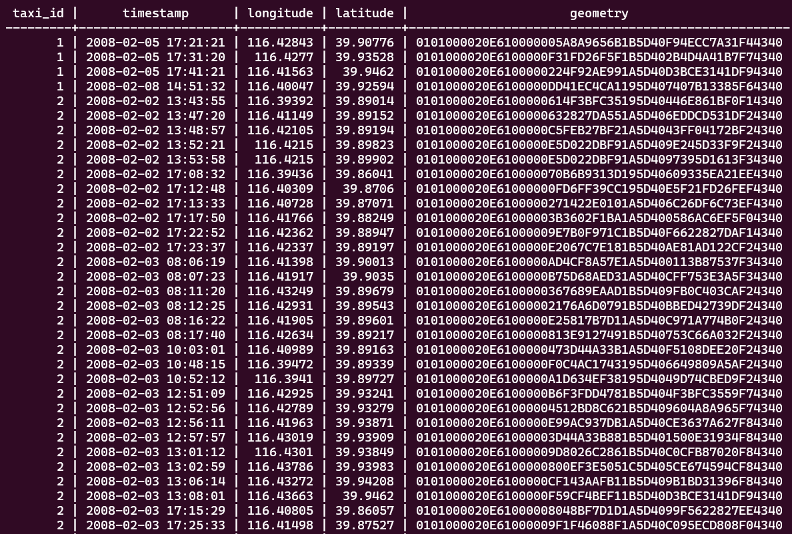

# GEA(Ground Exposure Area)：地面曝光面积计算
```
1. 计算广告牌中心点坐标、高度
2. 计算广告牌方向向量（顺时针90度）
3. 计算曝光区域圆心坐标、半径
```
**证明GEA为什么是圆形(来自论文中的证明过程)**


# IA(Invisible Area)：建筑物遮挡区域计算
```
1.筛选出位于圆形范围内的建筑物
2.计算广告牌视线经过建筑物顶点与地面的交点
3.创建广告牌视线经过建筑物顶点与地面的交点构成的多边形
4.计算圆弧形遮挡区域
```


# VA(Visible Area)：可见区域计算
```
使用python的shapely库计算
原本希望前端通过turf.js计算，但无法实现
```


# 出租车GPS数据筛选
**[数据来源](https://www.microsoft.com/en-us/research/publication/t-drive-trajectory-data-sample/)：包含2008年北京一万多辆出租车一周的轨迹数据，约1500万个坐标点，总距离达到900多万公里。**
```
id,timestamp,longitude,latitude
1,2008-02-05 17:21:21,116.42843,39.90776
```
```
数据筛选由geopandas和shapely实现
将GPS点数据导入到数据库
统计曝光区域内24hGPS点的个数
绘制北京市东城区出租车GPS轨迹热力图
```


